# Projekt prikupljanja i analize podataka
### Autor: 
Anton Ilić

### Mentori:
_izv. prof. dr. sc._ Ana Meštrović

_dr. sc._ Slobodan Beliga

### Kolegij:
Upravljanje znanjem

### Vrijeme izrade
Studeni 2020 - Prosinac 2020

<hr>

## __Opis projekta__

Cijeli projekt je odrađen na aktualnom dalmatinskom portalu [Dalmacija Danas](https://www.dalmacijadanas.hr) pritom koristeći sve kategorije koje se na portalu nude.

U __prvom dijelu__ projekta potrebno izgraditi listu URL-ova koji vode na članke sa zadanog portala s vijestima te svaki članak zasebno obraditi struganjem željenih podataka u _.csv_ i _.json_ datoteku. Cijeli proces je odrađen automatiziranim putem u programskom jeziku Python 3 koristeći zavisnost modula za parsiranje web stranica, automatizirano slanje JavaScript zahtjeva i slanje HTTP zahtjeva.

__Drugi dio__ projekta uključuje analizu prikupljenjih podataka. Analiza je fokusirana na aktualnu krizu izazvanom novim koronavirusom, uzročnikom bolesti COVID-19. Članci su analizirani te svrstani u one koji se odnose te oni koji se ne odnose na aktualni virus. Podaci su prikazani tablično i grafički, a odnose se na omjer ukupnog broja članaka te onih koji se odnose na zadanu temu u odnosu na neki kriterij. Ti kriteriji su omjer po kategoriji, mjesecu ili pojedinačnom danu. Nadalje, određena je, tablično prikazana te vizualizirana frekventnost 25 najkorištenijih riječi na mjesečnoj bazi koje novinari na portalu koriste kada pišu o koronavirusu.

## Tehničke informacije

### Operacijski sustav
* Windows 10

 ### Alati i softver
 * Visual Studio Code
 * Windows WSL 1 (Optional)
 * pip 20.0.2 from /home/user/.local/lib/python3.6/site-packages/pip (python 3.6)
 * Python 3.6.9
 * Bliblioteke
    * _requirements.txt_ priložen u projektu

## Važna napomena

* Izgrađene baze podataka nisu uključene u Git repozitorij jer bi na taj način ovaj projekt kršio uvjete korištenja portala. Podaci u ovom projektu su korišteni isključivo kao demonstracija korištenja primjenjenih metoda  u svrhu savladavanja gradiva na konkretnim primjerima na kolegiju Upravljanje znanjem. Komercijalna upotreba tih podataka nije dozvoljena.

<br>

<div style="text-align:center" >

## Prikaz elemenata portala

### Naslovnica


<br>

### Prikaz kategorije Sport 

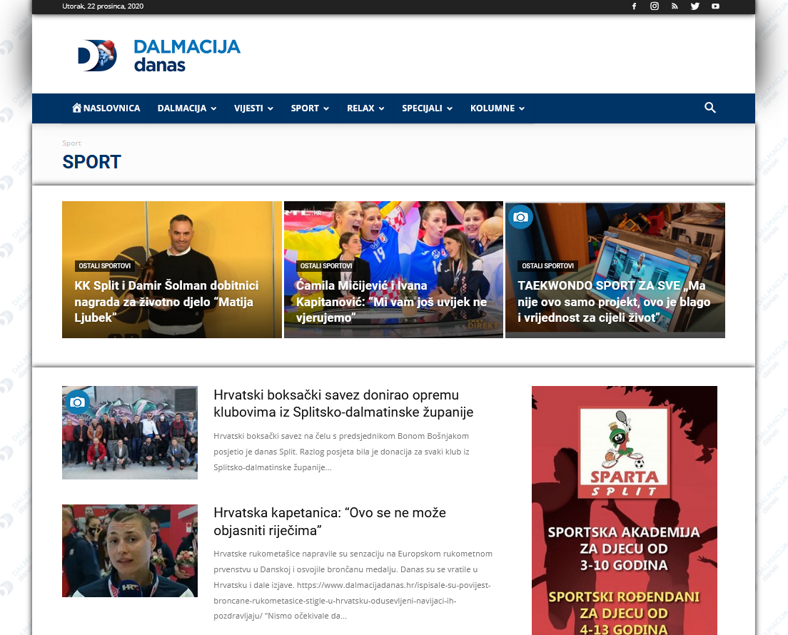

<br>

### Emotikoni i obrazac za komentiranje članka


</div>


## __Prva faza__

U prvoj fazi izrade projekta izrađene su jedinstvene skripte _article_url_scraper.py_ i article_scraper.py koje služe za dohvaćanje podataka, u nastavku je objašnjen način rada svake pojedine skripte.

### Način rada

__Napomena__: Detaljan način rada je opisan u svakoj pojedinoj skripti.

### __article_url_scraper.py__

Skripta služi za prikupljanje jedinstvenih URL-ova na svaki članak na portalu u razdoblju od 1.1.2020 do 30.11.2020. Automatska navigacija web stranicom omogućena je koristeći se _Selenium_ i _Requests_ modulima. Identifikacija i parsiranje svakog pojedinog elementa je omogućena korištenjem _BeautifulSoup4_ modula za Python 3.

Skripta prvo otvara željeni portal te  se preko naslovne stranice identificiraju glavne kategorije pretraživanjem HTML elemenata. Koristeći petlju, skripta otvara svaku pojedinu glavnu kategoriju u svrhu prikupljanja URL-ova na članke. Za navigaciju kroz svaku pojedinu kategoriju, na portalu je implementirana _JavaScript_ skripta koja omogućuje beskonačni scroll kojim se lista vidljivih članaka proširuje. Iz tog razloga, ta se skripta simulira od strane _Selenium_ modula koji scrolla stranicu određeni broj puta da bi ti članci postali vidljivi u _HTML-u_ web stranice. Zatim se svaki pojedini članak otvara, iz njega se analizaju meta podaci. Modul _BeautifulSoup4_ izvlači datum objave i poveznicu na članak. Ukoliko je članak iz željenog datumskog razdoblja (1.1.2020 do 30.11.2020), sprema se u željenu tekstualnu datoteku _output/portal_urls.txt_. Zatim se prelazi na sljedeću kategoriju, a postupak se ponavlja.

Zbog činjenice da svaki scroll "košta" 1.5 sekundu, te da je svaki pojedini članak potrebno otvoriti i respektivno analizirati radi provjere uvjeta, ova skripta se za željeni interval datuma izvodi po više od 8 sati.

Rezultat skripte je lista od 22436 jedinstvenih poveznica na članke portala.

__Prikaz generiranih URL-ova__

<div style="text-align:center" >


</div>

### __article_scraper.py__

Skripta služi za sekvencijalno otvaranje svih URL-ova prikupljenih skriptom _article_url_scraper.py_ te prikupljanje željenih podataka iz svakog članka. Rezultati se spremaju u _output/portal_articles.csv_ te _output/portal_articles.json_, a stvara se i svojevrsni dnevnik tekućeg pokretanja u mapi _output/_. Tablica u nastavku prikazuje podatke koji se prikupljaju.


| Podatak             | Tip podatka   | Opis podataka  |
| :-------------       |:-------------:| :------------|
| ID                  | int           | Jedinstveni identifikator članka|
| Title               | str           | Naslov članka                   |
| Subtitle            | str           | Podnaslov članka                |
| URL                 | str           | Poveznica na članak             |
| Section             | str           | Kategorija u kojoj se članak nalazi |
| Article_text        | str           | Cijeli tekst članka             |
| Published_time      | str/date pars.| Datum objave članka              |
| Modified_time       | str/date pars.| Datum zadnje modifikacije članka |
| Author              | str           | Autor članka i/ili fotograf      |
| Comments            | str           | Broj komentara na pojedinom članku |
| Reaction_love       | int           | Broj korisnika koji su na članak reagirali reakcijom 1 |
| Reaction_laugh      | int           | Broj korisnika koji su na članak reagirali reakcijom 2 |
| Reaction_hug        | int           | Broj korisnika koji su na članak reagirali reakcijom 3 |
| Reaction_ponder     | int           | Broj korisnika koji su na članak reagirali reakcijom 4 |
| Reaction_sad        | int           | Broj korisnika koji su na članak reagirali reakcijom 5 |
| Reaction_mad        | int           | Broj korisnika koji su na članak reagirali reakcijom 6 |
| Reaction_mind_blown | int           | Broj korisnika koji su na članak reagirali reakcijom 7 |

<br>

Za izvođenje ove skripte potrebno je oko 8 sati.

<Primjer prikupljenih podataka iz _portal_articles.json_

<div style="text-align:center" >

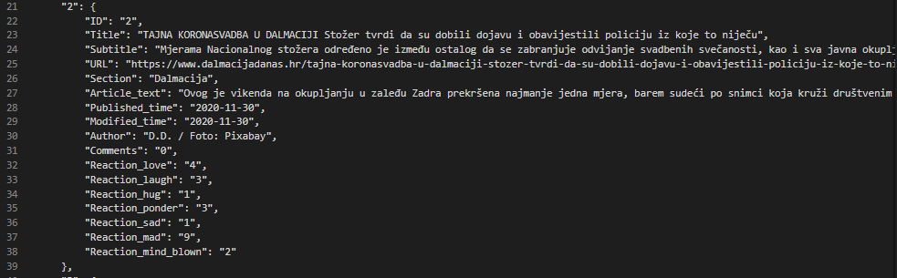

</div>

## Upute za pokretanje prvog dijela 

Skripte je moguće pokrenuti zasebno upisivanjem njihovog imena u _Terminal/CMD_:
```
python article_url_scraper.py
```
```
python article_scraper.py
```

Također, moguće je pokretanje pomoću _main_scrape.py_ skripte koja sekvencijalno pokreće jednu po jednu skriptu jednom komandom:
```
python main_scrape.py
```
<br>

## __Druga faza__

U drugoj fazi izrade projekta koriste se skripte _article_tabler.py_, _article_grapher.py_ i _article_language.py_. One služe za kategorizirani prikaz podataka i njegovu vizualizaciju. Osim toga, služe i za analizu jezika korištenog pri pisanju članaka.

### Način rada

__Napomena__: Detaljan način rada je opisan u svakoj pojedinoj skripti.

### __article_url_tabler.py__

Primarna namjena skripte je identifikacija članaka koji se odnose na tematiku COVID-19 virusa te sumarizacija tih članaka, kao i ukupnog broja članaka. Osim toga, skrita je zadužena i za stvaranje pregleda broja članaka po danu, mjesecu i kategoriji portala.

Identifikacija COVID-19 članaka je realizirana pomoću tekstualne datoteke _input/covid_dictionary.txt_. Ona sadrži listu čestih riječi/pojmova koji se spominju u kontekstu izvještavanja o bolesti. Neki od primjera tih izraza su: _stožer_, _COVID-19_, _zaraženih_, _samoizolaciji_,...
Zatim se tekstualni stupci koji sadrže tekst članka razdvajaju na riječi koje se uspoređuju s riječima iz _covid_dictionary.txt_ liste. Ukoliko su riječi pronađene, u novi stupac _COVID_ datoteke _output/portal_articles_covid.csv_ se upisuje vrijednost 1, ukoliko članak ne sadrži te riječi, upisuje se 0.

Zatim se ti članci prebrojavaju ovisno o kriteriju te se rezultati upisuju u _.csv_ datoteke u _output/tables_categorized_. Njihov prikaz slijedi u nastavku.

Prilikom pokretanja skripte te izgradnje _portal_articles_covid.csv_ datoteke, prikazuje se ukupan broj članaka i broj COVID-19 članaka.

<div style="text-align:center" >

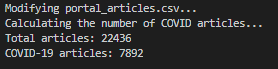

</div>

<br>

Prva generirana tablica se odnosi na dnevni pregled broja članaka od 1.1.2020 do 30.11.2020 vezanih uz COVID-19 i ukupni broj. Pregled podataka za 335 redova ručno nije zahvalan posao, zato je ova tablica iskorištena za grafički pregled koristeći sljedeću skriptu.

<div style="text-align:center" >

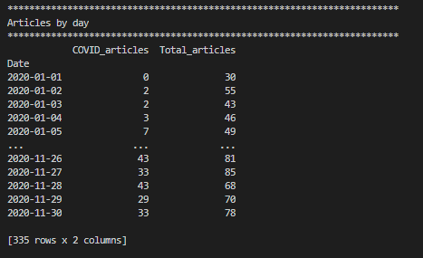

</div>

<br>

Druga tablica se odnosi na pregled broja članaka vezanih uz COVID-19 i ukupan broj članaka po svakoj kategoriji koju portal ima. Tablica je sortirana abecedno, a vidljivo je da portal najviše resursa usmjeruje u kategoriju _Dalmacija_, _Vijesti_ i _Sport_ što je i očekivano zbog općeg interesa čitatelja za ta područja. Također, i žuta kronika (_Relax_) nije zapostavljena. 

Prije navedene najpopularnije rubrike imaju najviše zastupljeni udio COVID-19 članaka što nije čudno budući da se radi domeni izvještavanja svakodnevnih događaja. Osim toga, vidljivo je da portal podosta zapostavlja podkategorije od kojih neke gotovo da i nemaju novih objava. Iz tog razloga su u daljnjoj analizi te kategorije ujedinjene pod kategoriju _Other_.

<div style="text-align:center" >

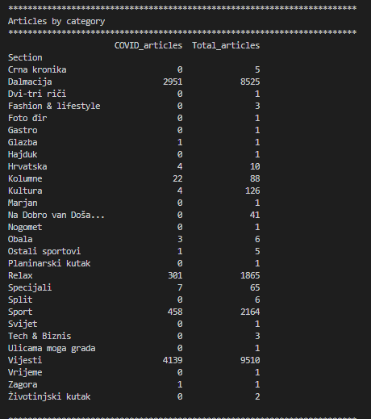

</div>

<br>

Treća tablica se odnosi na pregled ukupnog broja COVID-19 članaka te ukupnog broja članaka na portalu na mjesečnoj bazi. Iz nje je vidljiv eksponencijalni rast COVID-19 tema u razdoblju kada informacije o njemu gotovo da i nisu bile dostupne (Ožujak i Travanj), odnosno kad je država bila pod mjerom _Lockdown-a_. To se može interpretirati i kao panična faza pandemije. U tom razdoblju je portal također imao najviše objava, a njihov je broj očito bio "napumpan" velikim brojem COVID-19 članaka. Tijekom ljeta je taj broj opao, budući da se tematika jednostavno zapostavila, pretežito zbog spašavanja turizma od strane vladajućih. Zatim se u zadnja dva mjeseca vidi neki ponovni rast.

<div style="text-align:center" >

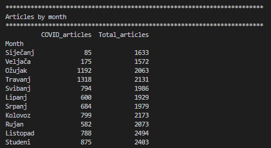

</div>

### __article_url_grapher.py__

Skripta učitava _.csv_  tablice kreirane u skripti _article_url_tabler.py_ te ih vizualizira pomoću prikladnih grafova koji se nakon izvedbe spremaju u _graphing/_ mapu. U nastavku slijedi prikaz tih grafova.

#### __Grafovi i interpretacije__

Stupčasti graf prikazuje ukupan odnos između broja članaka koji se odnose na COVID-19 i onih koji se ne odnose, pritom je vidljivo da skoro pola članaka u razdoblju od 1.1.2020 do 30.12.2020 izvješćuju o COVID-19 tematici.

<div style="text-align:center" >

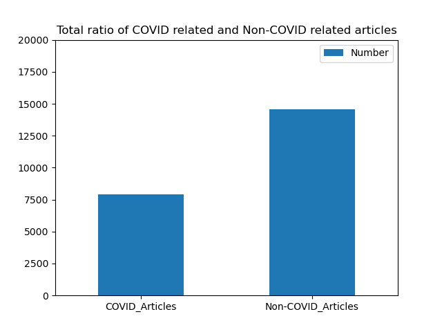

</div>

<br>

Tortasti graf u nastavku prikazuje iste podatke prikazane u obliku prikladnijem za vizualizaciju omjera, prilikom toga su prikazani i postoci.

<div style="text-align:center" >

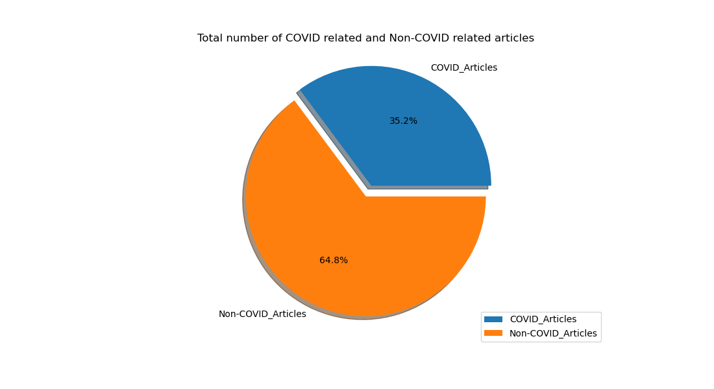

</div>

<br>

Graf prikazuje dnevnu distribuciju ukupnog broja članaka i članaka koji se odnose na COVID-19. Pritom su skokovi vidljivi za vrijeme 2. i 3. mjeseca što je već zaključeno u prethodnom poglavlju kod tablice koja prikazuje mjesečnu distribuciju. Također, ponovno je vidljiv ljetni pad izvještavanja te skok pri izvještavanju dolaskom hladnijih godišnjih goba i povratka virusa.

<div style="text-align:center" >

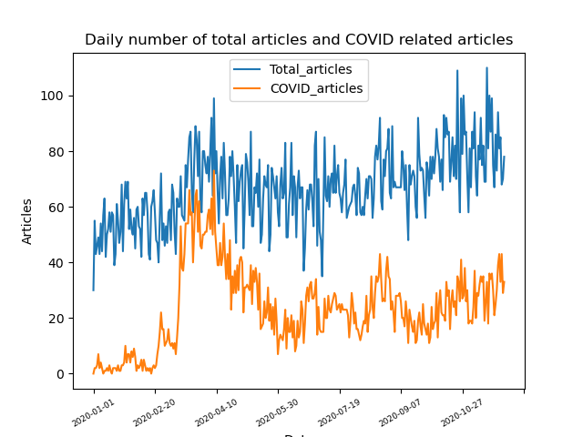

</div>

<br>

Kutijasti dijagram u nastavku pokazuje neke statističke podatke vezane uz dnevnu pojavu članaka. 

* Vidljivo je da srednja vrijednost iznosi oko 20 objava vezanih uz COVID-19, dok dnevna vrijednost ukupnog broja članaka iznosi oko 65. 
* Donji i gornji kvartil se od medijana razlikuju za nešto više od 5 članaka. 
* Minimalni broj članaka vezanih uz COVID-19 iznosi 0, dok maksimalni iznosi 60-ak. 
* Minimalni broj ukupnog broja članaka na dnevnoj bazi iznosi nešto manje od 40, dok maksimalni iznosi oko 100-ak.

<div style="text-align:center" >

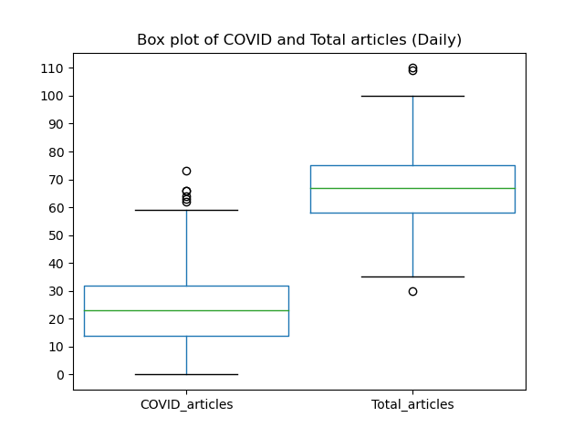

</div>

<br>

Stupčasti graf prikazuje tablicu prikaza broja članaka po kategorijama prikazanu u prošloj skripti (_article_tabler.py_). Pritom ovaj graf prikazuje koliko veliku razliku ima portal u broju napisanih članaka po kategorijama. Vidljivo je da COVID-19 ima više objava u kategoriji _Dalmacija_ nego ukupno u kategoriji _Relax_ (Žuta kronika) na koju su portali inače jako usredotočeni. To samo pokazuje razmjere promjene u načinu rada koje je virus uzrokovao.

<div style="text-align:center" >

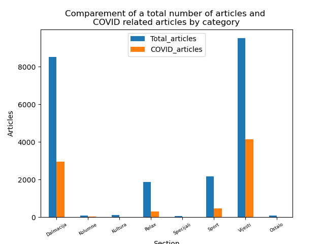

</div>

<br>

Tortasti graf prikazuje omjere između kategorija po zastupljenosti COVID-19 članaka. Prtiom su vidljivi i postoci.

<div style="text-align:center" >

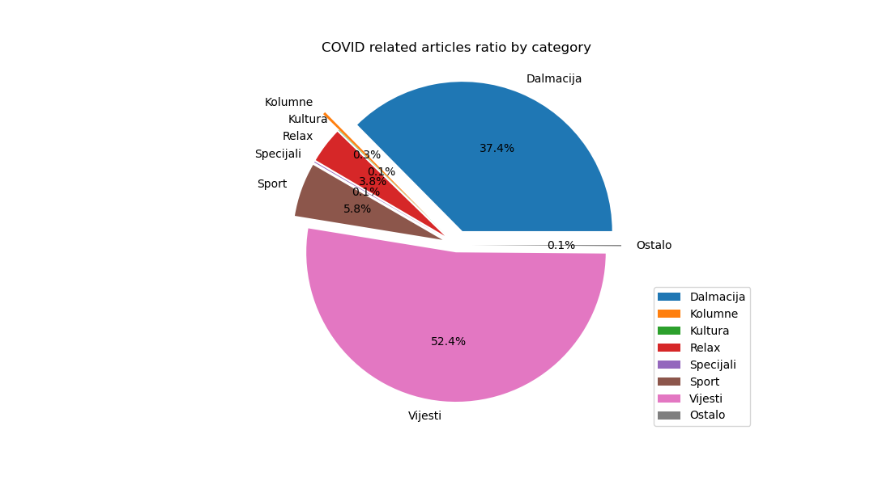

</div>

<br>

Stupčasti graf također vizualizira rezultate prikazane u tablici broja članaka po mjesecima iz skripte _article_tabler.py_. Vidljiva je velika sličnost s grafom koji prikazuje broj članaka na dnevnoj bazi, ali u nešto urednijem i preglednijem formatu. Ovaj graf prikazuje jednu zanimljivu pojavu, a to je da ukoliko usporedimo Siječanj i Listopad, broj članaka se povećao za točno toliko koliko iznosi broj COVID-19 članaka. Zanimljivi dio je to da većina tih ostalih vijesti na portalu promakne u sjeni onih koje su vezane za virus.

<div style="text-align:center" >

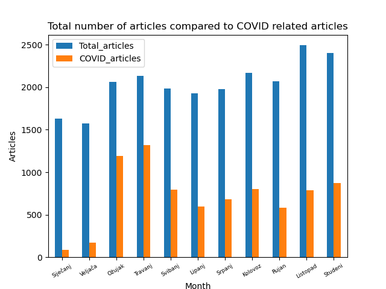

</div>

<br>

Kutijasti dijagram prikazuje statistički pregled po mjesecu, ali podatke je nešto teže interpretirati zbog uskih intervala.
* Srednja vrijednost COVID-19 vijesti iznosi oko, dok srednja vrijednost ukupnog broja iznosi oko 2100.
* Minimalna vrijednost objava vezanih uz COVID i ona vezana uz ukupni broj se drastično ne razlikuje od vrijednosti donjeg kvartila.
* Maksimalni broj članaka vezanih uz COVID-19 iznosi nešto manje od 1250, dok od ukupnog broja članaka iznosi nešto manje od 2500.

<div style="text-align:center" >

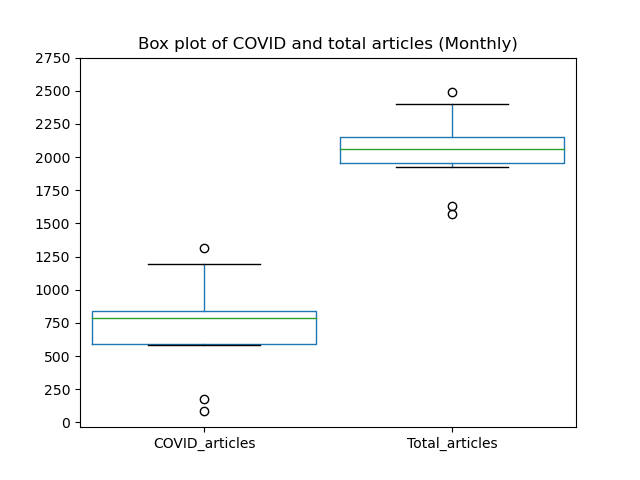

</div>

<br>

### __article_language.py__

Skripta služi za jezičnu obradu tekstualnog dijela portala što uključuje naslov, podnaslov i cijeli tekst u svrhu analize jezičnog diskursa.

__Prva faza__ rada skripte uključuje izoliranje članaka koji su u prijašnjim skriptama označeni kao članci vezani uz COVID-19, odnosno u kojima je binarna varijabla COVID jednaka 1. Iz tih je članaka izdvojen stupac koji označava vrijeme objave i spojene stupce koji se odnose na naslov, podnaslov i cijeli tekst članka. Rezultati su spremljeni u _/output/discourse_csv/portal_covid_isolated.csv_ datoteku radi izbacivanja stupaca koji nisu bitni za ovaj dio analize.  

__Druga faza__ rada skripte je stvaranje liste zaustavnih riječi. To su riječi koje rečenici ne nose smisao niti informaciju, a to mogu biti veznici, uzvici, prilozi, prijedlozi, čestice,.. Radi se o nepromijenjivim vrstama riječi koje je lako izbaciti iz teksta uvođenjem liste bez naprednog procesiranja.

Eliminacija tih riječi je realizirano stvaranjem "sirovih" baza riječi u mapi _input/raw_stopw/_ koje se jednostavnom funkcijom spajaju u jedinstveni riječnik. Taj riječnik (_stop_words_merged.txt_) sadrži riječi koje kroz obradu moraju biti izbačene. Iteriranjem kroz datoteku _portal_cvoid_isolated.csv_ izbacuju se zaustavne riječi.

__Treća faza__ rada se odnosi na stvaranje mjesečnog pregleda 25 najzastupljenijih riječi. Ovisno o mjesecu, broji se frekvencija te se gradi lista od 25 najčešćih riječi kojima se portal koristi u svakodnevnom radu. Te su liste spremljene u obliku _.csv_ datoteka u _output/word_frequencies/_, a njihove su tablice i grafovi prikazani u nastavku. Pritom su rezultati vizualizirani koristeći paket _wordcloud_, u njemu se riječi prezentiraju prema veličini ovisno o frekventnosti.

Rezultati te obrade slijede u nastavku za svih 11 mjeseci.

### Siječanj

<div style="text-align:center">

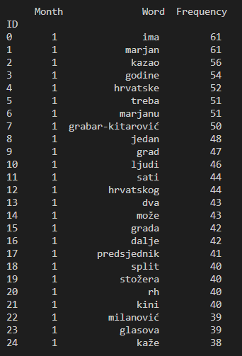


</div>

### Veljača

<div style="text-align:center">

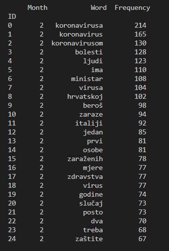


</div>

### Ožujak

<div style="text-align:center">

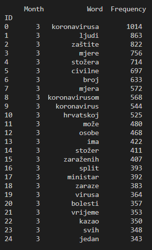


</div>

### Travanj

<div style="text-align:center">

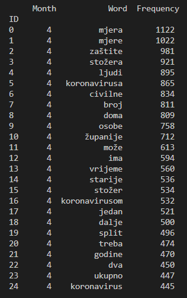


</div>

### Svibanj

<div style="text-align:center">

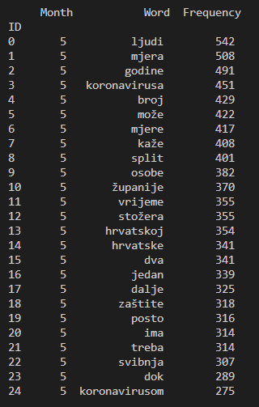


</div>

### Lipanj

<div style="text-align:center">

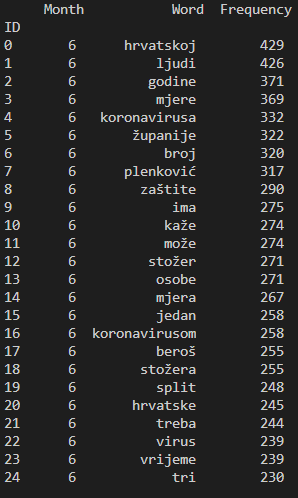


</div>

### Srpanj

<div style="text-align:center">

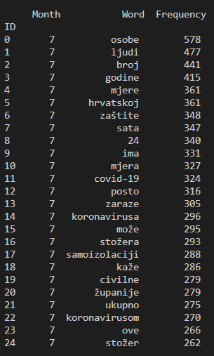


</div>

### Kolovoz

<div style="text-align:center">

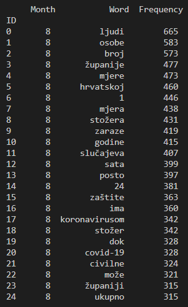


</div>

### Rujan

<div style="text-align:center">

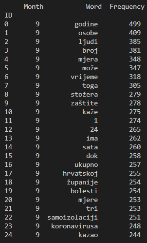


</div>

### Listopad

<div style="text-align:center">

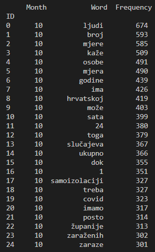


</div>

### Studeni

<div style="text-align:center">

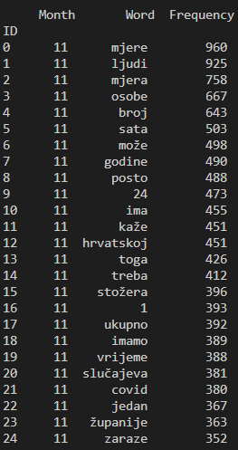


</div>

<br>

Pregledom svih grafova je utvrđena frekventnost 25 najkorištenijih riječi za svaki mjesec. Pomnijom analizom se može uočiti da se najkorištenije riječi odnose na tada tek završene predsjedničke izbore gdje su frekventne riječi. Tu je zastupljeno i ime tada aktualne bivše predsjednice Kolinde Grabar-Kitarović. Tu je također riječ predsjednik vjerojatno korištena u kontekstu novoizabranog predsjednika. Stožer za razliku od današnjeg je tada podrazumijevao izborni stožer kandidata za predsjednika. Također, vidljivo je da je portal jako fokusiran na splitsko područje po korištenju riječi Marjan i Split. 

Valja napomenuti da se radi o lažno klasificiranim podacima pod COVID statistiku budući da se neki slični termini kao što je "stožer" može biti korišten u kontekstu izbornog stožera i Stožera civilne zaštite. Radi se o razdoblju u kojem portali o tematici virusa nisu raspravljali, tako da tablicu za prvi mjesec nema smisla uključivati u analizu.

U Veljači se tonalitet mijenja. Koronavirus tematika postaje _de facto_ središnja tema na portalu te se u frekventnim riječima osim riječi koronavirus (i njegove varijacije) može pronaći i riječ Italiji. Italija se spominje zbog činjenice da je u drugom mjesecu bila jedna od najpogođenijih zemlja, pa nije ni čudno da se našla na toj listi.

Od veljače do danas se frekventne riječi nisu previše mijenjale. Broj riječi je određen trenutnom situacijom, što znači da se formira ovisno o mjerama i broju bolesnih. Visoko na listi se u svakom slučaju nalazi riječ ljudi, osobe i broj što je očekivano budući da se portal kao i svaki najviše obazire na nove broje iz dana u dan. Također je uočljivo da se u listi ponavlja broj 24 kao često ponavljana riječ. To je očekivano budući da većina izjava na tu temu počinje sa "U posljednja 24 sata...". 

Problem u ovoj vrsti analize predstavljaju promijenjive vrste riječi koje zagađuju konačnu listu od 25 riječi. Eliminacija takvih riječi bi vjerojatno dala puno bolje rezultate, ali čak i sada je moguće izvući neku interpretaciju. Iz riječi se po mjesecima može zaključiti da portal ne iznosi previše mišljenja na temu virusa, već da iz dana u dan izvještava o brojkama novozaraženih te o prenošenju izjava vladajućih na aktualnu temu.

### __Jaccardov indeks__

Odnos korištenih riječi na mjesečnoj bazi možemo prikazati [Jaccardovim indeksom](https://en.wikipedia.org/wiki/Jaccard_index) kojim dobivamo uvid u presjek skupova unije. Radi se o koeficijentu koju u odnosu na broj sličnosti između dva promatrana skupa rezultira u broju između 0 i 1. Ukoliko je broj bliže 1, postoji veća sličnost, dok ukoliko je broj manji od jedan, postoji manja sličnost. 

Skupovi (mjeseci) su uspoređeni u paru po dvoje na način da se svaki mjesec usporedi s onim sljedećim (_Npr._ Siječanj-Veljača, Veljača-Ožujak,). Tablični i grafički prikaz su prikazani u nastavku. 

U tablici je vidljiv poprilično mali presjek između vokabulara prvog i drugog mjeseca, što je i očekivano budući da zbog loše klasifikacije taj rezultat nema smisla promatrati. Što se tiče ostalih mjeseci, u pravilu je vidljiv veći presjek riječi. Vidljivo je da je vokabular između 2. i 6. mjeseca konstantan zbog ozračja u kojem se svijet nalazio. Zatim je vidljiv pad kroz 6. i 7. mjesec zbog činjenice da se virus teže širi ljeti zbog čega pada aktualnost teme. Povratkom virusa krajem ljeta, koeficijent se ponovno povećava, gdje ostaje do danas. 

<br>

<div style="text-align:center">


</div>

<br>


U nastavku slijedi i grafički prikaz koeficijenata presjeka dobivenog Jaccardovim indeksom.

<div style="text-align:center">

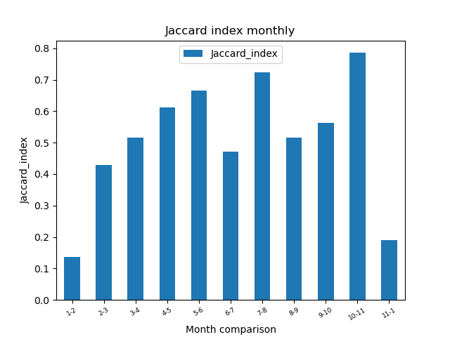

</div>

<br>

## Upute za pokretanje drugog dijela 

Skripte je moguće pokrenuti zasebno upisivanjem njihovog imena u _Terminal/CMD_:
```
python article_tabler.py
```
```
python article_grapher.py
```
```
python article_language.py
```

Također, moguće je pokretanje pomoću _main_analyse.py_ skripte koja sekvencijalno pokreće jednu po jednu skriptu jednom komandom:
```
python main_analyse.py
```